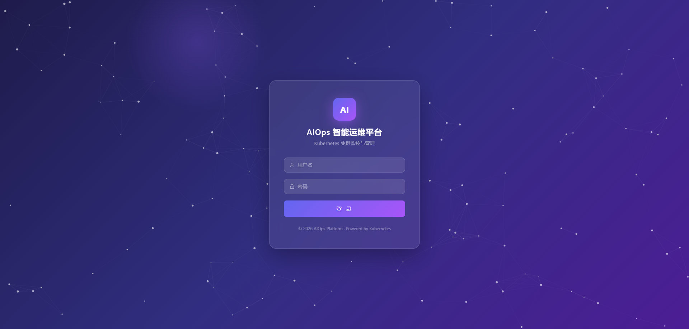
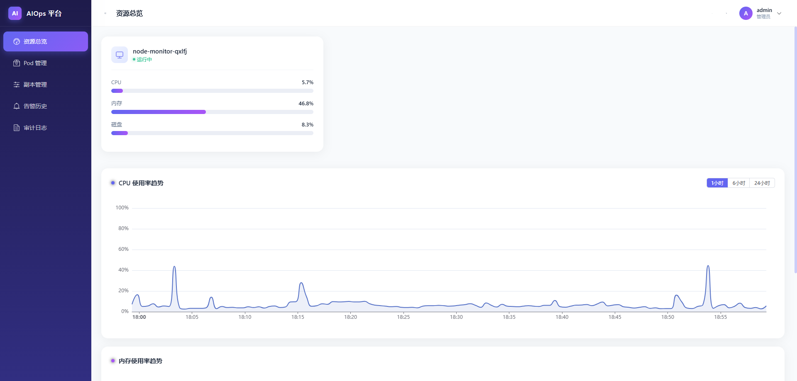
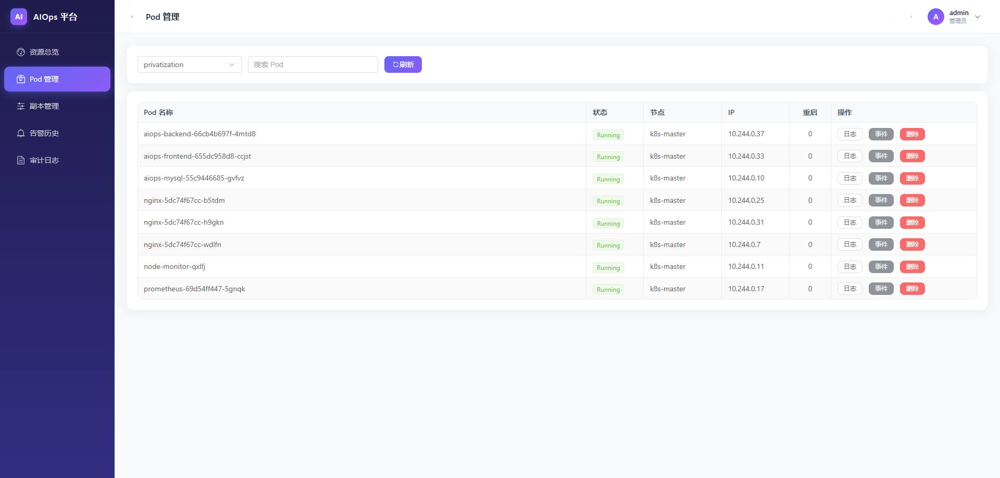
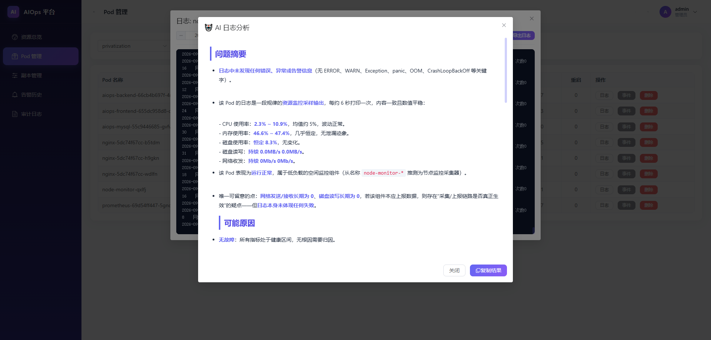
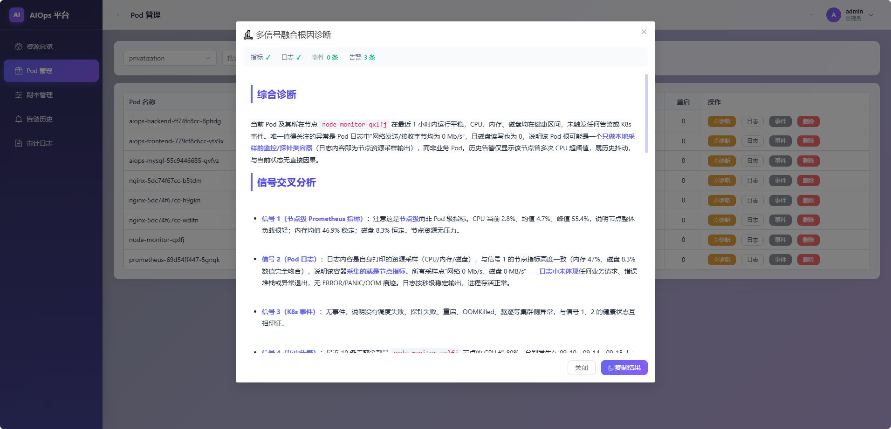
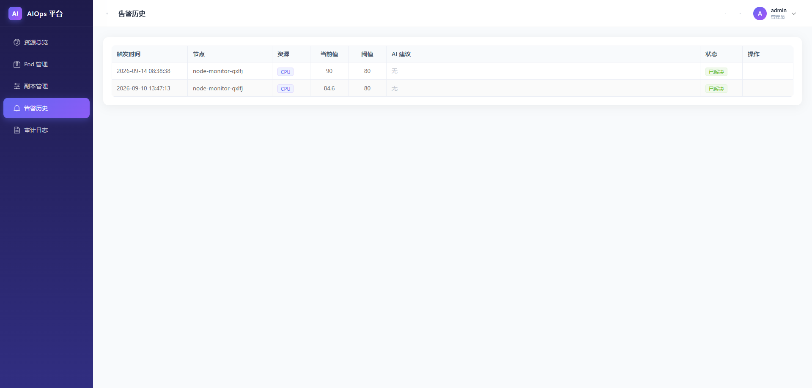
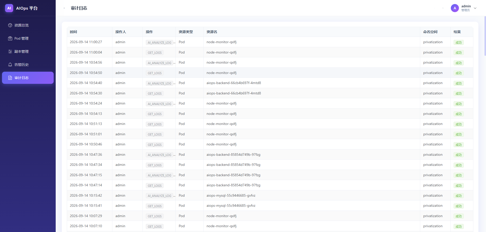
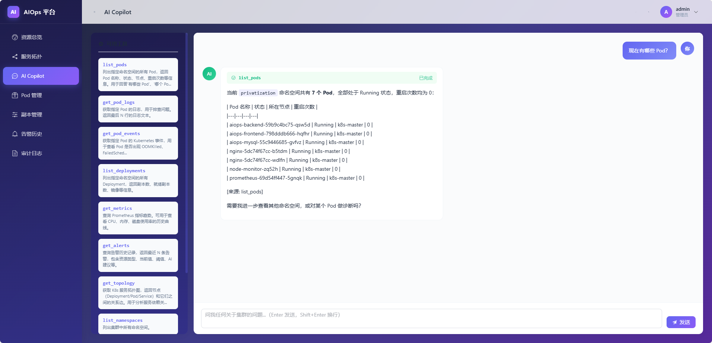
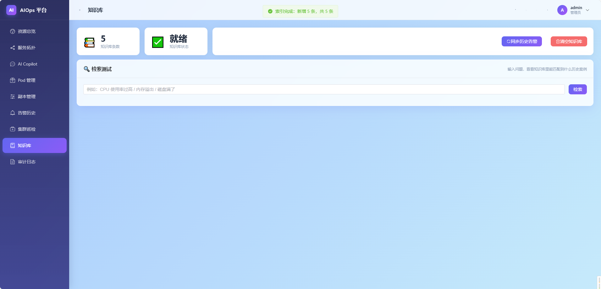
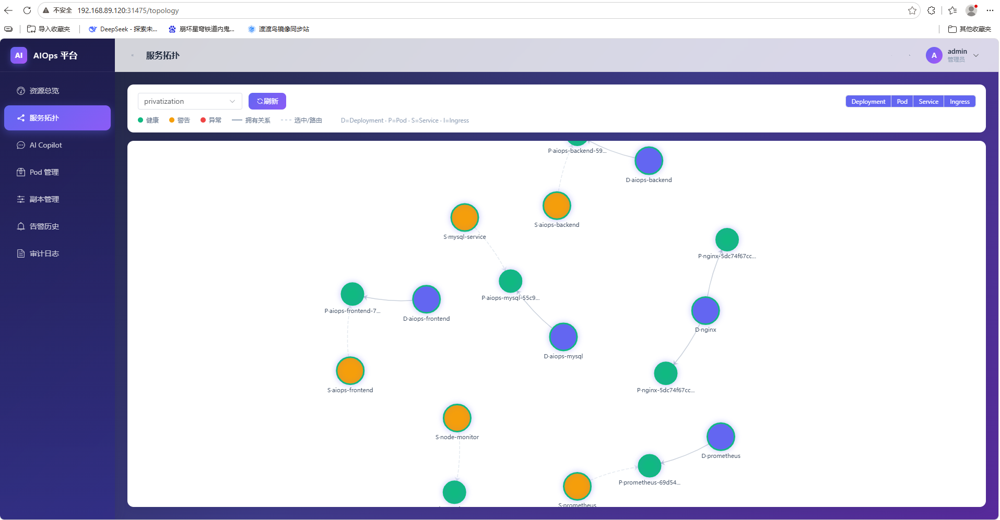

# AIOps 智能运维平台

基于 Kubernetes 的云原生智能运维平台，集 **节点监控、SRE 级告警治理、服务拓扑、AI Copilot、集群巡检、RAG 知识库、智能诊断、操作审计** 于一体。

> 从单机 Python 脚本演进而来，完成 **容器化 → K8s 部署 → Web 平台化 → AI 智能化 → Agent 化 → 知识增强** 的完整升级。

------

## 🌟 核心亮点

### 一、SRE 级告警治理

从固定阈值逐步演进到完整的告警治理链路：

```
原始采集 → 滑动窗口 → 告警聚合 → AI 根因分析 → 一条聚合告警
```


| 层级         | 方案                               | 解决的问题     |
| :----------- | :--------------------------------- | :------------- |
| **滑动窗口** | 10 个采样点中超标占比 ≥ 70% 才告警 | 过滤抖动误报   |
| **冷却机制** | 告警后进入 60 秒冷却期             | 避免连续告警   |
| **告警聚合** | 5 分钟窗口内的告警合并分析         | 减少告警数量   |
| **AI 根因**  | 批量告警交给大模型推断共同根因     | 关联分析       |
| **量化指标** | 压缩率、误报率、MTTA、MTTR         | 治理效果可衡量 |

### 二、七层 AI 能力

| 层级  | 能力                    | 说明                                                         |
| :---- | :---------------------- | :----------------------------------------------------------- |
| **1** | AI 告警分析             | 告警触发时自动调用大模型，结合历史数据生成根因推断           |
| **2** | AI 日志分析             | 一键分析 Pod 日志，输出问题摘要、可能原因、排查步骤          |
| **3** | 多信号融合诊断          | 聚合 Prometheus 指标 + Pod 日志 + K8s 事件 + 历史告警，AI 交叉验证 |
| **4** | 告警聚合根因            | 5 分钟窗口内多条告警批量分析，生成一条根因告警               |
| **5** | **AI Copilot（Agent）** | 基于 Function Calling，AI 自主调用 15 个工具，SSE 流式输出，标注数据来源 |
| **6** | **集群巡检**            | 11 条规则扫描集群配置隐患，输出健康分 + 修复建议             |
| **7** | **RAG 知识库**          | 历史告警向量化检索，诊断时自动注入相似案例，Copilot 可主动查询 |

### 三、服务拓扑图

通过 K8s 的 `OwnerReference` 和 `Label Selector` 自动推导资源关系：

```
Ingress → Service → Pod ← ReplicaSet ← Deployment
```


前端用 ECharts Graph 力导向布局渲染，节点颜色表示健康度，点击查看详情。

### 四、Human-in-the-loop 写操作

Copilot 支持修改集群，但**AI 不直接执行**：

```
用户：把 nginx 扩到 5 个副本
  ↓
AI：调用 scale_deployment 工具
  ↓
后端：检测到写操作，返回待确认（不执行）
  ↓
前端：渲染确认卡片 "将 nginx 从 2 副本调到 5 副本"
  ↓
用户点"确认执行"
  ↓
后端：真正执行 + 写审计日志（标记为 COPILOT_XXX）
```


**设计原则：AI 只提议，用户有最终决定权，所有操作可追溯。**

### 五、RAG 知识库

```
索引流程（离线）：
  历史告警 → 拼成文本 → BGE Embedding → 存入 ChromaDB
                                              ↓
检索流程（在线）：
  诊断触发 / 用户提问 → query 转向量 → Chroma 检索 top-5 → 注入 Prompt
```


**两个集成入口：**

| 入口             | 触发方式    | 场景                       |
| :--------------- | :---------- | :------------------------- |
| **诊断自动检索** | 系统自动    | 每次诊断前检索历史相似案例 |
| **Copilot 工具** | AI 主动调用 | 用户问"以前有类似问题吗"   |

------

## 🏗️ 系统架构

```
┌──────────────────────────────────────────────────────┐
│                    用户浏览器                         │
│          Vue3 + TypeScript + Element Plus             │
│  Dashboard/拓扑/Copilot/Pod管理/巡检/知识库/...        │
└────────────────────────┬─────────────────────────────┘
                         │ HTTP / SSE / WebSocket
┌────────────────────────▼─────────────────────────────┐
│                  Nginx（前端容器）                     │
│         /api/* 反向代理 + SSE 透传 + WebSocket         │
└────────────────────────┬─────────────────────────────┘
                         │
┌────────────────────────▼─────────────────────────────┐
│              后端（FastAPI + Uvicorn）                │
│  ┌────────┬────────┬────────┬────────┬────────────┐  │
│  │ JWT认证 │ K8s API│ Prom API│拓扑推导 │ AI Copilot │  │
│  ├────────┼────────┼────────┼────────┼────────────┤  │
│  │ 巡检引擎│ RAG检索 │ 多信号诊断│ 告警聚合 │ 审计日志 │  │
│  └────────┴────────┴────────┴────────┴────────────┘  │
└────┬────────────┬────────────┬────────────┬──────────┘
     │            │            │            │
┌────▼────┐  ┌───▼────┐  ┌────▼─────┐  ┌───▼────────┐
│  MySQL  │  │ K8s    │  │Prometheus│  │ DeepSeek   │
│  存储   │  │ API    │  │  TSDB    │  │  + BGE     │
└────▲────┘  └────────┘  └────▲─────┘  └────────────┘
     │                        │
┌────┴────────────────────────┴─────────────────────┐
│         采集器 DaemonSet（每节点一个）              │
│  采集指标 → 滑动窗口 → 告警聚合 → AI 分析          │
│  暴露 :8000/metrics → Prometheus 抓取              │
└───────────────────────────────────────────────────┘
```


------

## ✨ 功能特性

### 一、节点监控与告警治理

- 多维度采集：CPU、内存、磁盘、磁盘 I/O、网络流量
- DaemonSet 部署，挂载宿主机 `/proc`、`/sys`
- 滑动窗口告警（过滤抖动）+ 告警聚合（窗口内合并）
- 4 个量化指标：压缩率、误报率、MTTA、MTTR
- Webhook 通知（企业微信/钉钉/飞书）

### 二、AI 智能分析（7 层）

- AI 告警分析、日志分析、多信号融合诊断
- 告警聚合根因、AI Copilot（Agent）
- 集群巡检、RAG 知识库

### 三、服务拓扑图

- K8s 资源关系自动推导
- ECharts Graph 力导向布局
- 健康度可视化 + 点击节点查看详情

### 四、Kubernetes 资源管理

- Pod 管理：列表、实时日志、事件、删除、AI 诊断
- Deployment 管理：副本扩缩容
- 命名空间与节点总览

### 五、实时日志流

- WebSocket 推送，无需手动刷新
- 智能滚动（不打扰查看历史）
- 一键导出 `.log`

### 六、集群巡检

- 11 条规则：未配 requests/limits、未配探针、镜像 latest、单副本、无 endpoints 等
- 输出健康分 + 分级问题清单 + 修复建议
- 集成为 Copilot 工具

### 七、RAG 知识库

- 历史告警向量化索引（ChromaDB + BGE）
- 诊断时自动检索相似案例
- 独立知识库管理页（状态、检索测试、索引/清空）

### 八、安全与审计

- JWT 认证 + RBAC 权限分级（管理员/只读）
- 操作审计（含 AI 操作，标记 `COPILOT_XXX`）

------

## 🛠️ 技术栈

| 层次          | 技术                                                         |
| :------------ | :----------------------------------------------------------- |
| **采集器**    | Python 3.9、psutil、prometheus_client、pymysql               |
| **后端**      | FastAPI、Kubernetes Python Client、PyJWT、bcrypt、Pydantic、OpenAI SDK |
| **前端**      | Vue3、TypeScript、Element Plus、ECharts、Pinia、Vue Router   |
| **存储**      | MySQL 8.0、Prometheus TSDB                                   |
| **AI**        | DeepSeek API（Function Calling / SSE）                       |
| **Embedding** | BGE-large-zh-v1.5（硅基流动 API）                            |
| **向量库**    | ChromaDB（PersistentClient）                                 |
| **部署**      | Docker、Kubernetes（DaemonSet/Deployment/Service/RBAC）      |
| **通信**      | HTTP、SSE、WebSocket                                         |
| **告警治理**  | 滑动窗口、冷却机制、告警聚合、量化指标                       |

------

## 📁 项目结构

```
aiops-platform/
├── collector/                       # 采集器（DaemonSet）
│   ├── monitor.py                   # 主采集循环 + 滑动窗口告警
│   ├── aggregation.py               # 告警聚合器
│   ├── Prometheus_config.py         # 指标暴露
│   ├── AI.py                        # AI 告警 + 聚合分析
│   ├── alter.py                     # Webhook 告警（单条 + 聚合）
│   ├── history.py / mysql_config.py
│   ├── load_config.py / logger.py
│   ├── requirements.txt / Dockerfile
│
├── backend/                         # Web 后端
│   ├── main.py                      # FastAPI 入口 + WebSocket
│   ├── core/
│   │   ├── config.py                # 全局配置
│   │   └── security.py              # JWT + bcrypt
│   ├── models/
│   │   ├── database.py / schemas.py
│   ├── services/
│   │   ├── k8s_service.py           # K8s API 封装
│   │   ├── prometheus_service.py    # Prometheus 查询
│   │   ├── topology_service.py      # 拓扑推导
│   │   ├── health_check_service.py  # 集群巡检引擎
│   │   ├── embedding_service.py     # BGE 文本向量化
│   │   ├── rag_service.py           # ChromaDB 索引 + 检索
│   │   ├── alert_service.py / audit_service.py
│   │   ├── ai_log_service.py        # AI 日志分析
│   │   ├── ai_diagnose_service.py   # 多信号诊断 + RAG 集成
│   │   ├── copilot_tools.py         # 15 个工具定义 + 执行器
│   │   └── copilot_service.py       # Copilot Function Calling
│   ├── routers/
│   │   ├── auth.py / pods.py / deployments.py
│   │   ├── metrics.py / alerts.py / audit.py
│   │   ├── topology.py / copilot.py
│   │   ├── health_check.py          # 集群巡检路由
│   │   └── rag.py                   # RAG 索引/检索路由
│   ├── requirements.txt
│   └── Dockerfile.backend
│
├── frontend/                        # Web 前端
│   ├── src/
│   │   ├── api/                     # 8 个 API 封装
│   │   ├── views/                   # 10 个页面
│   │   │   ├── Login.vue
│   │   │   ├── Dashboard.vue        # 资源总览 + 量化指标
│   │   │   ├── Topology.vue         # 服务拓扑
│   │   │   ├── Copilot.vue          # AI Copilot（含确认卡片）
│   │   │   ├── PodManage.vue        # Pod 管理 + AI 诊断
│   │   │   ├── DeploymentManage.vue
│   │   │   ├── AlertHistory.vue
│   │   │   ├── HealthCheck.vue      # 集群巡检
│   │   │   ├── RagManage.vue        # 知识库管理
│   │   │   └── AuditLog.vue
│   │   ├── components/ / layout/ / router/ / stores/
│   │   ├── config/ / utils/
│   ├── package.json / vite.config.ts / nginx.conf / Dockerfile
│
└── k8s/                             # K8s 部署清单
    ├── mysql.yaml
    ├── collector-daemonset.yaml
    ├── rbac.yaml
    ├── backend.yaml / frontend.yaml
    └── prometheus/
```


------

## 🚀 快速开始

### 前置条件

- Kubernetes 集群（v1.20+）
- Docker
- DeepSeek API Key（AI 功能）
- 硅基流动 API Key（RAG Embedding）

### 一键部署

```
git clone https://github.com/你的用户名/aiops-platform.git
cd aiops-platform
chmod +x deploy.sh
./deploy.sh
```


### 手动部署

```
# 1. 命名空间和 Secret
kubectl create namespace privatization
kubectl create secret generic aiops-secret -n privatization \
  --from-literal=mysql-password='root123456' \
  --from-literal=jwt-secret="$(openssl rand -hex 32)" \
  --from-literal=webhook-url='' \
  --from-literal=api-key='sk-你的DeepSeekKey' \
  --from-literal=embedding-api-key='sk-你的硅基流动Key'

# 2. 依次部署
kubectl apply -f k8s/mysql.yaml
kubectl apply -f k8s/collector-daemonset.yaml
kubectl apply -f k8s/rbac.yaml
kubectl apply -f k8s/backend.yaml
kubectl apply -f k8s/frontend.yaml
kubectl apply -f k8s/prometheus/

# 3. 获取访问地址
kubectl -n privatization get svc
```

**默认账号**：`admin` / `admin123`

  ------

  ## 📸 项目截图

  ### 登录页

  

  *深紫渐变背景 + 粒子动画 + 玻璃拟态卡片*

  ### Dashboard 资源总览

   

  *节点状态卡片 + CPU/内存实时趋势图*

  ### Pod 管理

   

  *Pod 列表 + 日志/事件/诊断/删除*

  ### 实时日志 + AI 分析

  

  *WebSocket 实时日志 + AI 智能分析*

  ### 多信号融合诊断

  

  *四类信号交叉验证 + AI 根因推断*

  ### 告警历史

  

  *告警记录 + AI 建议 + 状态管理*

  ### 审计日志

  

  *所有变更操作留痕*

  ### AI Copilot分析

  

  *根据定义的工具相应用户的请求*

  ### RAG知识库

  

  *根据告警历史案例进行判断*

  ### 服务拓扑

  

  *pod-service-ingress之间的关系*

  ------

## 💡 技术难点与解决方案

### 1. 容器内采集宿主机指标

**问题**：容器有独立命名空间，`psutil` 读到的不是宿主机数据。
**解决**：DaemonSet 挂载宿主机 `/proc`、`/sys`，配合 `privileged` 权限。

### 2. Pod 无法访问外网

**问题**：采集器调用 DeepSeek/企业微信 API 超时。
**排查**：Flannel SNAT 未开启 → MTU 不足 → CDN IP 部分不可达。
**解决**：`EnableSNAT: true` + MTU 1400 + `hostAliases` 固定 IP。

### 3. WebSocket 阻塞事件循环

**问题**：打开日志后后端 Pod 变成 `0/1`，readiness probe 超时。
**根因**：K8s Client 的 `follow=True` 是同步阻塞调用，占住 FastAPI 事件循环。
**解决**：用线程池（`run_in_executor`）隔离同步调用，改为 2 秒轮询 + 增量推送。

### 4. 固定阈值告警误报

**解决**：滑动窗口——10 个采样点中超标占比 ≥ 70% 才告警。

### 5. 多节点告警风暴

**解决**：5 分钟窗口内的告警合并，AI 分析共同根因，输出一条聚合告警。

### 6. SSE 流式输出被缓冲

**问题**：Copilot 的流式输出前端要等很久才显示。
**根因**：Nginx 默认缓冲 SSE 响应。
**解决**：响应头加 `X-Accel-Buffering: no`，Nginx 加 `proxy_buffering off`。

### 7. ChromaDB sqlite3 版本不兼容

**问题**：CentOS 7 系统 sqlite3 < 3.35.0，ChromaDB 启动报错。
**解决**：安装 `pysqlite3-binary`，在 `rag_service.py` 顶部替换 `sqlite3` 模块。

### 8. ChromaDB metadata 不接受 datetime

**问题**：从 MySQL 查出的 `triggered_at` 是 datetime 对象，Chroma 只接受 str/int/float/bool。
**解决**：`str(a.get('triggered_at', ''))` 显式转换。

### 9. Python 依赖版本冲突

**问题**：`openai==1.30.0` 与新版 `httpx` 不兼容；`numpy 2.0` 与 `chromadb 0.4.24` 不兼容。
**解决**：`openai>=1.55.0` + `httpx>=0.27.0` + `numpy<2.0`。

### 10. RBAC 权限不足

**问题**：拓扑推导报 `Forbidden: services/replicasets/ingresses`；巡检报 `Forbidden: endpoints`。
**解决**：`ClusterRole` 按需补齐资源权限。

------

## 🔑 环境变量说明

### 采集器

| 变量                                           | 说明               | 默认值   |
| :--------------------------------------------- | :----------------- | :------- |
| `CPU_MAXUSE` / `MEMORY_MAXUSE` / `DISK_MAXUSE` | 告警阈值           | 80/90/80 |
| `INTERVAL`                                     | 采集间隔（秒）     | 3        |
| `ALERT_WINDOW_SIZE`                            | 滑动窗口大小       | 10       |
| `ALERT_THRESHOLD_RATIO`                        | 超标占比阈值       | 0.7      |
| `ALERT_COOLDOWN`                               | 冷却时间（秒）     | 60       |
| `AGGREGATE_WINDOW`                             | 告警聚合窗口（秒） | 300      |

### 后端

| 变量                                                         | 说明                |
| :----------------------------------------------------------- | :------------------ |
| `SECRET_KEY`                                                 | JWT 签名密钥        |
| `MYSQL_*`                                                    | MySQL 连接信息      |
| `PROMETHEUS_URL`                                             | Prometheus 地址     |
| `API_KEY` / `API_URL`                                        | DeepSeek API        |
| `LOG_MODEL_NAME` / `DIAGNOSE_MODEL_NAME` / `COPILOT_MODEL_NAME` | 各场景模型          |
| `EMBEDDING_API_KEY` / `EMBEDDING_API_URL` / `EMBEDDING_MODEL` | BGE Embedding       |
| `CHROMA_PERSIST_DIR`                                         | ChromaDB 持久化目录 |
| `ANONYMIZED_TELEMETRY`                                       | 关闭遥测            |

------

## 📊 项目数据

| 指标         | 数值                                    |
| :----------- | :-------------------------------------- |
| 代码文件     | 110+                                    |
| 后端接口     | 26                                      |
| 前端页面     | 10                                      |
| AI 能力      | 7 层                                    |
| Copilot 工具 | 15 个                                   |
| 巡检规则     | 11 条                                   |
| 告警治理策略 | 滑动窗口 + 冷却 + 聚合 + 量化           |
| K8s 资源     | DaemonSet × 1、Deployment × 5、RBAC × 3 |

------

## 🎯 后续规划

- 故障复盘报告（Postmortem）自动生成
- SLO / 错误预算定义与监控
- 告警与变更关联分析（可疑变更标记）
- 动态阈值（EWMA / 3-sigma）
- 多集群管理
- Grafana 集成
- ChromaDB 改用 PVC 持久化 + 独立部署
  
